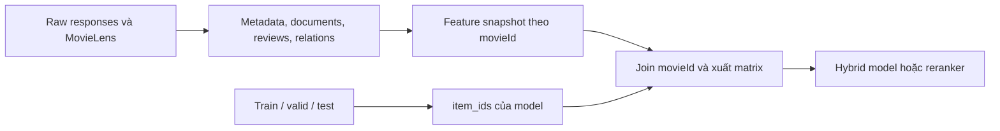

# Tổ chức dữ liệu movie enrichment

Đề xuất ngày 06/10/2026, dựa trên file và schema đang có trong repository.
Tài liệu này mô tả cấu trúc cần xây dựng; các bảng/snapshot đề xuất chưa được tạo.

Khuyến nghị giữ Parquet, Polars, NumPy và raw JSON gzip đang dùng. Tách ba lớp:
raw responses → dữ liệu chuẩn hóa theo movieId → feature có phiên bản.
Catalog gốc là toàn bộ 27.278 phim MovieLens; các split là những tập con của catalog.

## 1. Cấu trúc hiện tại

```text
data/
  raw/
    ml-20m.zip
    ml-20m/
      ratings.csv
      README.txt
    movie_metadata/
      tmdb/en-US/<request-kind>/*.json.gz
      wikidata/en-US/<request-kind>/*.json.gz
      wikipedia/en-US/<request-kind>/*.json.gz
    wikimedia_coverage/
      wikidata_mapping_v1/*.json.gz
      enwiki_revisions_v1/*.json.gz
      viwiki_revisions_v1/*.json.gz
  processed/
    ml20m_lightgcn/
      interactions.parquet
      train.parquet
      valid.parquet
      test.parquet
      manifest.json
    movie_content/
      catalog.parquet
      provenance.parquet
      crawl_status.parquet
      manifest.json
artifacts/
  movie_content/
    report.md
    wikimedia_coverage/
      coverage.parquet
      manifest.json
      report.md
      fetch_stats.json
      validation.json
      identity_issues.json
  lightgcn_ml20m/...
  lightgcn_retrain/...
  lightgcn_search/...
  multvae_ml20m/...
```

| Khối | Dữ liệu thực tế | Cách tổ chức |
| --- | --- | --- |
| MovieLens gốc | 27.278 phim; 20.000.263 ratings | ZIP chứa movies, links, tags, genome-tags, genome-scores và ratings; thư mục đã giải nén hiện chỉ có ratings/README. |
| Interactions sau xử lý | 9.911.879 dòng; 129.757 users; 11.508 movies | Bốn cột userId, movieId, rating, timestamp; giữ ID gốc. |
| Splits | Train 7.238.638; valid 741.976; test 1.931.265 dòng | Các file Parquet và manifest riêng. |
| Catalog metadata | 11.508 dòng, một dòng/movieId | Bảng rộng: tên, genre, overview, cast/directors/writers, ngôn ngữ, runtime, IDs. TMDB chính, Wikimedia fallback. |
| Provenance metadata | 277.262 dòng | Một dòng/field được điền: nguồn, external ID, raw path, URL, language, fetched_at, revision_id. |
| Crawl status metadata | 34.524 dòng | Một dòng/movieId/provider, gồm cả nguồn chưa cần dùng; không phải toàn bộ lịch sử request. |
| Wikimedia coverage | 27.278 dòng | QID, split membership, trạng thái, URL/revision, độ dài text và các cờ wd_* về sự hiện diện thuộc tính. |
| Review/aggregate rating chuẩn hóa | Chưa có | Raw TMDB có vote_average/vote_count trong nhiều responses; chưa được xuất thành bảng điểm tổng hợp. Chưa có corpus user reviews. |
| Semantic feature từ nội dung | Chưa có | LightGCN/Mult-VAE hiện đọc interactions; checkpoint có user_ids/item_ids và weights, chưa đọc catalog metadata. |

Số phim duy nhất: train 11.508, valid 10.622, test 11.386; hợp ba tập 11.508.
Mọi movieId trong valid/test hiện đều có trong train. Không cộng số lượng từng split
để làm mẫu số catalog, và không gắn một nhãn split duy nhất cho phim.

### Phần đã có và phần cần xây dựng

- Raw Wikipedia của phép đo đã chứa revision wikitext; có thể trích xuất nội dung
  chuẩn hóa từ cache, không cần tải lại các responses đã thành công.
- coverage.parquet giữ số ký tự và trạng thái, **chưa chứa văn bản lead/plot**.
- Raw SPARQL của phép đo Wikidata chứa exact IMDb mapping, description và cờ
  có thuộc tính. **Cờ wd_genres/wd_cast/... chưa phải giá trị genre/cast**.
  Cần lấy entity/statement values cho các QID mới để dựng metadata/relations.
  Raw entity responses của crawler fallback chỉ hỗ trợ một phần catalog.
- movie_content/catalog.parquet hiện có text/metadata thật, nhưng chỉ trên
  11.508 phim và chỉ chứa phần Wikimedia được gọi theo logic fallback.

## 2. Cấu trúc đích

```text
data/
  raw/
    ml-20m.zip                             # nguồn gốc
    movie_metadata/...                    # cache hiện có, còn giữ tham chiếu
    wikimedia_coverage/...                # cache phép đo, còn giữ tham chiếu
    movie_sources/<source>/<run_id>/
      <request_id>.json.gz                 # responses mới, giữ từng lần thu thập
  processed/
    ml20m_lightgcn/...                     # bộ interactions/splits hiện có
    movie_enrichment/
      CURRENT.json                        # trỏ snapshot đã kiểm tra
      v1/<snapshot_id>/
        movies.parquet
        split_membership.parquet
        movie_source_ids.parquet
        movie_metadata.parquet
        documents.parquet
        provenance.parquet
        crawl_status.parquet
        catalog.parquet                   # view tiện dùng, một dòng/movieId
        manifest.json
        entities.parquet                  # bổ sung khi dựng semantic graph
        movie_relations.parquet
        reviews.parquet                   # bổ sung khi đã thu nhận reviews
        rating_aggregates.parquet
        tags.parquet                      # tùy chọn: dữ liệu MovieLens
        genome_scores.parquet
    movie_features/<feature_set_id>/
      document_chunks.parquet
      chunk_index.parquet
      chunk_vectors.npy
      movie_index.parquet
      movie_vectors.npy
      structured_features.parquet
      availability.parquet
      manifest.json
artifacts/
  movie_content/...                        # kết quả đo/QA và báo cáo hiện có
  enrichment_runs/<run_id>/...
  <model>/<training_run>/
    input_features/
      item_index.parquet
      item_vectors.npy
      manifest.json
    ...                                   # checkpoint, metrics, history
```

Các file entities/relations/reviews/tags/genome là bước mở rộng. Manifest phải
ghi rõ bảng nào đã thu thập, chưa thu thập hoặc không áp dụng; không coi bảng
chưa thu thập là nguồn có độ phủ bằng 0.

Snapshot là một phiên bản dữ liệu hoàn chỉnh. Viết vào thư mục staging, kiểm tra
ID/schema/provenance/coverage, rồi mới công bố snapshot và đổi CURRENT.json atomically.
Các snapshot đã được model tham chiếu cần giữ nguyên. Manifest ghi hash từng file;
không dựa vào việc thay lần lượt nhiều Parquet để có một snapshot nhất quán.

## 3. Các bảng cốt lõi

| Bảng | Một dòng đại diện cho | Khóa/cột chính |
| --- | --- | --- |
| movies | Một phim MovieLens | movieId Int64, movielens_title, release_year, genres_movielens; đúng 27.278 ID. |
| split_membership | Một phim trong protocol split hiện tại | movieId, split_manifest_hash, in_train, in_valid, in_test. |
| movie_source_ids | Một kết quả ghép phim với định danh nguồn | mapping_id, movieId, source, entity_type, external_id String, language, mapping_status, match_method, candidate_ids, evidence_observation_id. |
| movie_metadata | Metadata của một phim từ một provider | metadata_id, movieId, source, source_entity_id, language, title, original_title, release_date/year, runtime_minutes, genres, cast, directors, writers, countries, keywords, description, observation_id, extractor_version. |
| documents | Một đoạn nội dung của phim từ nguồn/phiên bản cụ thể | doc_id, movieId, mapping_id, source, source_document_id, language, doc_type, section_key/title, text, text_hash, revision_id, source_url, observation_id, extractor_version, char_count, quality_flags. |
| provenance | Nguồn của một record/field được chuẩn hóa hoặc chọn vào catalog | record_type, record_id, field, element_key nullable, upstream_record_id, source, observation_id, source_url, revision_id, license_uri, attribution_text. |
| crawl_status | Một observation của request | observation_id, run_id, request_key, source, endpoint, status, attempts, HTTP status, fetched_at, raw_path, raw_sha256, error. |
| catalog | View đã chọn giá trị cho từng phim | movieId, tên/năm/runtime/genres/... đã chọn, selected_metadata_ids, preferred_doc_ids, has_text_en/vi, missing_fields; 27.278 dòng. |

movie_metadata dùng typed columns và list/struct tương tự catalog hiện có. Mỗi
provider giữ một bản riêng trong snapshot; quy tắc hợp nhất chỉ tạo catalog view.
Ví dụ genres từ MovieLens/TMDB/Wikidata giữ namespace nguồn; chuẩn hóa taxonomy
nếu cần phải có mapping được ghi phiên bản. Không tự coi các label giống nhau
là cùng một entity hoặc cùng một genre.

provenance của catalog cần trỏ về metadata_id/doc_id đã chọn và observation gốc.
Với phần tử list có nhiều nguồn, giữ source/ID ở từng phần tử, hoặc lưu quan hệ
riêng; một nguồn gán cho toàn bộ list không thể hiện đủ nguồn từng giá trị.

Giá trị thiếu dùng null và cờ chất lượng. Đơn vị runtime, độ chính xác ngày/tháng/
năm của Wikidata và quy tắc đổi đơn vị cần được ghi trong extractor/provenance;
không mặc định quantity không rõ đơn vị thành phút. language của nội dung nguồn
khác original_language của phim.

### Định danh và thời gian

- movieId gốc là khóa liên kết trong phạm vi MovieLens 20M. Chỉ số liên tục dùng
  cho tensor là khóa kỹ thuật của từng feature/model export, không thay movieId.
- IMDb ID là String, giữ tiền tố tt và số 0 đầu. External IDs khác cũng lưu String;
  luôn kèm source/entity_type. tmdb:movie:862 khác tmdb:person:862.
- mapping_status phân biệt verified, ambiguous, not_found, unverified, mismatch,
  unsupported_media và request_error. Chỉ mapping đã xác minh được cấp nội dung
  cho phim; candidates của mapping mơ hồ giữ để xử lý riêng.
- source_published_at, source_updated_at hoặc revision_at, và fetched_at là các
  mốc khác nhau. Timestamp chuẩn hóa dùng UTC; published_at không có thì null.
  Không suy ngày đăng review từ ngày crawler tải dữ liệu.
- Raw batch có thể phục vụ nhiều phim/bài. Các bảng tham chiếu observation/raw
  chung, không sao chép cả batch vào từng record phim.

### Nội dung và ngôn ngữ

doc_type tối thiểu: wikidata_description, overview, lead, plot, reception và other.
Description Wikidata có thể giữ ở metadata; nếu đưa vào documents thì vẫn giữ loại
riêng vì đây thường là mô tả nhận dạng ngắn.

Giữ lead, plot và reception tách nhau, đồng thời giữ bản EN/VI độc lập. reception
là tổng hợp phê bình/đón nhận trong bài, không phải user review. catalog có thể chọn
preferred_doc_ids theo nhu cầu nhưng không xóa các bản nguồn còn lại.

doc_id phải gắn với movie/source-document/revision/section/extractor version;
text_hash dùng phát hiện text trùng, không dùng một mình để nhận dạng phim.
Văn bản ngắn vẫn có thể được lưu với quality_flags; điều kiện >=100 ký tự là
policy chọn feature/đo coverage, không phải điều kiện giữ phim trong master.

Nếu dịch hoặc tạo synopsis bằng mô hình, lưu origin_kind, parent_doc_id, model/
prompt version và generated_at, để truy được bản nguồn. Bản dịch không được tính
là độ phủ Wikipedia VI nguyên bản. Có thể bổ sung derived_documents.parquet khi
thực sự triển khai bước này.

## 4. Reviews, rating và semantic graph

| Bảng mở rộng | Nội dung/cột cần giữ |
| --- | --- |
| reviews | review_id, source, source_review_id, movieId, mapping_id, language, title, text, text_hash, rating_value, rating_min/max, author_key theo namespace nguồn, published_at/updated_at/fetched_at, spoiler_flag nullable, source_url, observation_id. |
| rating_aggregates | movieId, source, vote_average, vote_count, rating_min/max, source_as_of nullable, fetched_at, observation_id. |
| entities | entity_key có namespace, source, external_id, entity_type, labels theo ngôn ngữ; người, genre, country, subject, tác phẩm nguồn. |
| movie_relations | edge_id, movieId, relation, target_entity_key, source, native_property/statement_id, role/order, qualifiers/rank khi có, observation_id. |
| tags | userId, movieId, tag, timestamp từ MovieLens. |
| genome_scores | movieId, tagId, relevance; tên tag trong bảng genome_tags khi nhập corpus. |

Ví dụ relation: acted_by, directed_by, written_by, has_genre, main_subject,
based_on. Hai người có cùng tên chưa đủ để hợp nhất entity; ID chéo và evidence
ghép entity được lưu riêng. Cast có thể có nhiều vai/credit cho cùng một người.

Review gốc và các annotation suy ra như sentiment/aspect/topics giữ tách biệt.
Khi cần, annotations.parquet liên kết bằng review_id/doc_id và version của job.
External author_key không được tự ghép thành userId MovieLens.

vote_count không đồng nghĩa số bài review đã thu thập. Điểm provider, rating từng
review và rating MovieLens là ba loại số liệu riêng. Giữ scale nguồn; chỉ tạo
điểm tổng hợp liên nguồn khi đã chọn và ghi rõ quy tắc chuẩn hóa.

Với source_review_id không có, định danh suy ra phải có prefix/hash và cờ
identity_method; thay đổi text có thể tạo version mới. Giữ candidate duplicates
để đối soát, không gộp hai review chỉ vì text_hash trùng.

## 5. Feature và liên kết với model

Luồng xử lý đề xuất:



Feature snapshot có thể tính cho toàn bộ 27.278 phim. movie_index.parquet ghi
row_idx → movieId để biết hàng nào trong movie_vectors.npy tương ứng phim nào.
Embedding text từ chunks cần chunk_index.parquet chứa chunk_id, doc_id, movieId,
char offsets/tokenization version và embedding row_idx. Policy pooling ghi cách
kết hợp chunks/documents/source/language; tránh tính lặp cùng nội dung vừa ở
article toàn phần vừa ở section.

availability.parquet lưu has_text_en/vi, has_plot, has_review, số documents,
review count đã thu thập và các mask thiếu feature. Placeholder vector 0 phải có
mask, không được diễn giải là embedding thật của một phim.

Manifest feature ghi input snapshot/hash, parser/chunker version, encoder model
và revision, pooling/normalization, dimensions/dtype, included/excluded sources,
feature families, movie_index hash và thời điểm build.

**Export cho LightGCN/Mult-VAE phải theo đúng item_ids của dataset/checkpoint.**
Loader hiện lấy item_ids từ train và checkpoint giữ mảng này. Quy trình export:

1. Tạo item_index: item_idx = vị trí, movieId = item_ids[item_idx].
2. Join item_index với movie_index qua movieId, lấy hàng tương ứng trong matrix.
3. Sắp theo item_idx, kiểm tra ID/thứ tự/hash, rồi ghi item_vectors.npy cho run.

Không lấy 11.508 hàng đầu của matrix 27.278 phim. Các item ngoài train có thể có
content vector, nhưng chưa tự có CF embedding trong LightGCN hiện tại. Đưa nội
dung vào scoring cần thêm hybrid/reranking/encoder tương ứng ở bước mô hình.

## 6. Snapshot dữ liệu và protocol đánh giá

Catalog toàn bộ có thể dùng để quản lý metadata của cả train/valid/test. Các
aggregate dựa trên tương tác MovieLens như popularity, user profile hay lịch sử
tags phải tuân theo allowed interaction inputs của từng protocol; mặc định train,
và train+valid chỉ cho run retrain đã xác định protocol riêng.

Feature/model manifest ghi split manifest hash, allowed interaction inputs,
external snapshot ID và temporal policy. Dữ liệu cào hiện hành phục vụ thí nghiệm
snapshot enrichment; không tự chứng minh đó là thông tin đã có ở thời điểm ratings
MovieLens. Nếu làm đánh giá lịch sử, phải chọn source revisions/reviews phù hợp
cutoff và đánh dấu trường hợp không có published/revision timestamp.

Tag Genome giữ là một feature family riêng, do nguồn được tạo từ ratings/tags/
reviews; protocol cần khai báo việc sử dụng thay vì mặc nhiên coi độc lập với
labels đánh giá. Các fitted transforms như vocabulary/IDF/PCA ghi rõ fit scope
để phân biệt protocol dùng training corpus với dùng toàn catalog metadata.

## 7. Lộ trình triển khai

1. **Master và IDs:** tạo movies + split_membership cho 27.278 phim; nhập kết quả
   ghép từ coverage và legacy catalog, giữ các mapping chưa xác minh làm candidates.
2. **Documents Wikimedia:** chuẩn hóa lead/plot EN/VI từ raw revisions đã lưu;
   giữ URL/revision/observation/parser version; bổ sung reception khi extractor hỗ trợ.
3. **Structured metadata:** nhập metadata hiện có theo provider; lấy giá trị
   Wikidata thực tế và entity labels còn thiếu cho catalog mở rộng. Xây graph
   relations khi cần, không dùng cờ presence làm nội dung thay thế.
4. **Catalog view và QA:** chọn scalar/list/doc theo policy đã ghi phiên bản;
   kiểm tra 27.278 phim, source identity, coverage từng scope, hashes và khả năng
   rebuild từ raw. Công bố snapshot đã kiểm tra.
5. **Feature:** chunk/encode/pool text; dựng structured features và missing masks;
   export theo item_ids của một experiment cụ thể.
6. **Reviews/tags/genome:** thêm từng nguồn sau, giữ đánh giá coverage/quality và
   protocol riêng. Khi reviews chưa thu thập, manifest ghi not_collected.

MVP ưu tiên bước 1–4 trên Wikimedia và metadata sẵn có. Các entry trong cache cũ
có thể được tham chiếu trực tiếp bằng raw_path/hash khi file được giữ nguyên;
không cần tải lại các responses đã thành công. Nếu tiếp tục dùng refresh của
crawler legacy có thể ghi đè cache, cần đóng băng responses mà snapshot tham chiếu
vào nơi lưu theo hash/phiên bản trước khi refresh. Với pipeline mới, giữ từng
phiên bản responses để provenance của snapshot cũ vẫn resolvable. Các bộ training
đã có tiếp tục tham chiếu splits cũ.

Tham chiếu: [crawler hiện tại](movie_content.md),
[phương pháp đo Wikimedia](wikimedia_coverage.md),
[kết quả coverage](../artifacts/movie_content/wikimedia_coverage/report.md),
[split dữ liệu](data_preparation.md), [khảo sát nguồn](movie_data_enrichment_survey.md).
